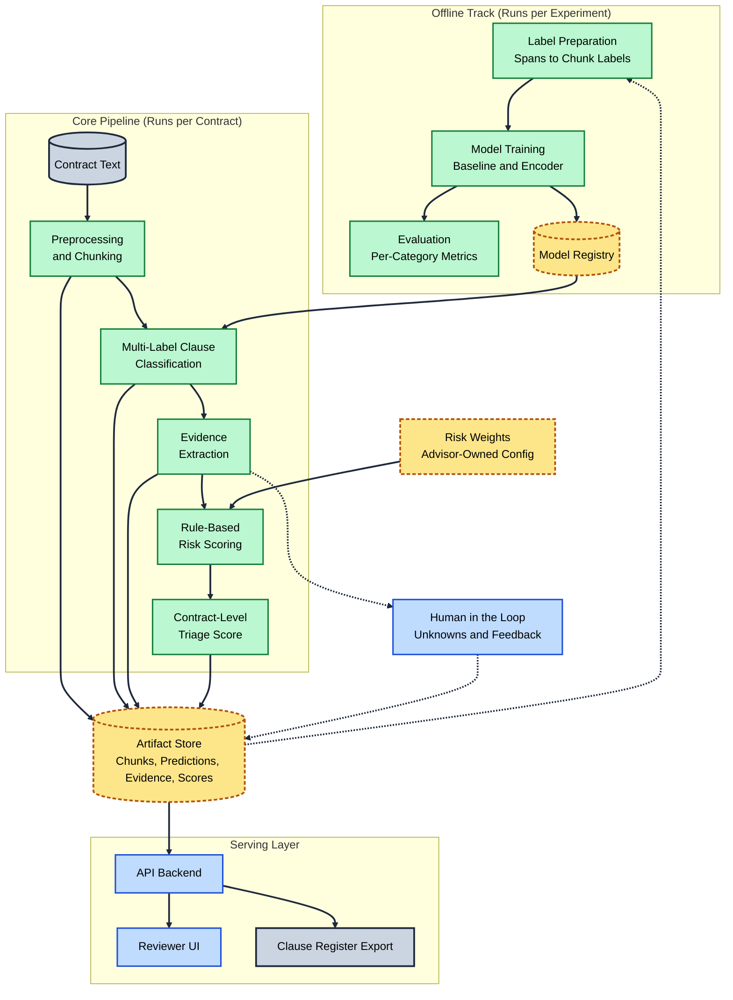

# Initial Architecture Plan

## Offline Track

### Label Preparation (Spans to Chunk Labels)
Projects the CUAD's annotated answer spans onto the chunk boundaries produced by preprocessing. This turns span-level ground truth into a multi-hot label vector per chunk. This step is required as CUAD is a span QA dataset, not a classification dataset. So, nothing downstream can train without this translation layer. 

### Model Training (Baseline and Encoder)
Fits the TF-IDF baseline & fine-tunes a transformer encoder on the chunk/label pairs to produce a multi-label clause classifier. Training occurs offline and separately from the runtime pipeline as it is expensive, iterative, and only needs to run when the model or input data changes. 

### Evaluation (Per-Category Metrics)
Scores the trained transformer encoder against the TF-IDF baseline using per-category precision, recall, and F1. CUAD's class imbalance makes accuracy misleading, so it is excluded. This gate exists to satisfy the brief's explicit success criterion. It's high-level goal is to catch a model that looks good in aggregate, but fails on individual clause types. 

### Model Registry
Stores the trained checkpoint, calibrated thresholds, and training seeds as a versioned artifact that the runtime pipeline can load. This decouples model training from inference. In other words, redeploying a new model becomes a pointer swap rather than a pipeline rewrite. Furthermore, every scored contract can be traced back to the exact model version that scored it.

## Core Pipeline

### Contract Text
Represents the raw contract document entering the pipeline (sourced from the CUAD JSON splits for evaluation, and potentially from new documents later). It is drawn as a database store rather than a process since it is the pipeline's external input boundary. This is the point where versioning starts.

### Preprocessing and Chunking
Normalizes the text & segments it into semantically coherent chunks, at either the section or clause level. This portion exists as transformer encoders have limited size context windows. Furthermore, clause-level chunking preserves the legal unit of meaning that both classification & evidence extraction depend on.

### Multi-Label Clause Classification
Applies the trained transformer encoder to each chunk, with the goal of predicting which of the 41 clause categories it belongs to (if any). This is the core "alpha generating" step of the entire system; every later stage, such as risk scoring, operates solely on clauses this step has identified.

### Evidence Extraction
Pulls the specific grounded text supporting each predicted clause & validates it against a strict schema. This step exists so that downstream risk scoring and the reviewer UI operate on verifiable evidence. This makes the tool audible & transparent, rather than a black box. 

### Rule-Based Risk Scoring
Combines the 4 risk signals **(Note: Define these 4 signals with CA)** into an aggregated `Low`, `Medium`, or `High` rating for each detected clause. This is distinct from classification as risk is a judgement layered on top of detection. Keeping it separate enables the team to retune scoring logic without retraining the model. 

### Contract-Level Triage Score
Aggregates the individual clause risk ratings into a single ranked score per contract. This is the deliverable specified in the brief. The goal is not simply to detect which clauses are risky in isolation, but to help reviewers prioritize which contracts to open first. 

## Serving Layer

### API Backend
Exposes the pipeline's stored outputs, chunks, predictions, evidence, and scores (over any HTTP for any client to consume). It serves as a separation layer so that the UI, the export, and any future client can all read from one contract. This prevents reaching into the artifact store directly. 

### Reviewer UI
Presents triage scores & supporting evidence to the end user in an interface (initially implemented as a lightweight Gradio POC). This is the layer that makes the pipeline usable by a non-technical professional, the core user base of a triage tool.  

### Clause Register Export
Produces a JSON or CSV file of the full clause-level register for a given contract (risk scored clause registered are specified as a distinct deliverable in the brief).

## Shared Infrastructure

### Artifact Store
Persists chunks, predictions, evidence, and scores from every pipeline run as a queryable form. This exists so that risk weights can be readjusted & rescored without rerunning the full classifier. From similar experiments, this caching approach can convert a retuning cycle from 20 minutes to a few seconds. 

### Risk Weights (Advisor-Owned Config)
Holds the category severity & signal weighting values thar risk scoring reads from (kept outside the code as a versioned config). This exists in isolation as these values are a domain judgement call beyond a pure engineering decision. Modularizing them lets the weights change without an entire code deployment.

### Human in the Loop (Unknowns and Feedback)
Captures clauses that the NLP pipeline/evidence extraction could not ground, in addition to any corrections the end user makes in the UI. Both are routed back into the artifact store. This layer exists as a guardrail to enforce the zero hallucination requirement, by giving ungrounded cases an explicit exit path instead of a guess. Furthermore, it serves as the baseline engine foundation for the active learning stretch goal, if implemented later.
