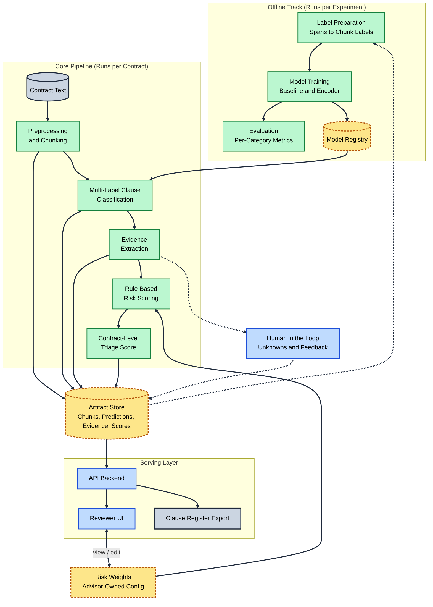

# Architecture & Tech Stack

## Key Constraints (from provided Accenture brief)

- Input is the CUAD JSON (`paragraphs[].context`, labeled spans in `paragraphs[].qas[].answers[]`). **No PDF parsing.**
- Official splits are fixed: `train_separate_questions.json` (408 contracts) and `test.json` (102 contracts). **Do not re-split.** Carve validation out of the train file by contract. `test.json` is touched only for final evaluation.

## Core Deliverables

1. **Clause detection:** per-category precision, recall, and F1 clearly beating the TF-IDF baseline, with error analysis.
2. **Risk layer:** 4-signal rule-based scoring validated against the advisor's hand-ranked clauses (Spearman, bucket agreement, sensitivity analysis).
3. **Clause registers:** evaluated for risk, one per contract.
4. **Repo:** clean and documented.
5. **Report:** final technical report, including limitations and estimated reviewer time saved.

## Stretch Goals

Nothing here ships until the core pipeline works end to end.

- **Gradio demo:** listed as a stretch goal in the brief.
- **React UI:** our own addition, not in the brief. Only if time permits after Gradio.
- **Span extraction:** trained model replacing the heuristic evidence module.
- **Active learning loop:** uses the feedback table and uncertainty sampling.

# Initial Architecture Plan

```mermaid
flowchart TB
  subgraph OFF["Offline Track (Runs per Experiment)"]
    O1["Label Preparation<br/>Spans to Chunk Labels"] --> O2["Model Training<br/>Baseline and Encoder"] --> O3["Evaluation<br/>Per-Category Metrics"]
    O2 --> O4[("Model Registry")]
  end
 
  subgraph PIPE["Core Pipeline (Runs per Contract)"]
    P1[("Contract Text")] --> P2["Preprocessing<br/>and Chunking"] --> P3["Multi-Label Clause<br/>Classification"] --> P4["Evidence<br/>Extraction"] --> P5["Rule-Based<br/>Risk Scoring"] --> P6["Contract-Level<br/>Triage Score"]
  end
 
  subgraph SERVE["Serving Layer"]
    S1["API Backend"] --> S2["Reviewer UI"]
    S1 --> S3["Clause Register Export"]
  end
 
  DB[("Artifact Store<br/>Chunks, Predictions, Evidence, Scores")]
  W1["Risk Weights<br/>Advisor-Owned Config"]
  W2["Human in the Loop<br/>Unknowns and Feedback"]
 
  O4 --> P3
  P2 --> DB
  P3 --> DB
  P4 --> DB
  P6 --> DB
  DB --> S1
  W1 --> P5
  S2 <-->|"view / edit"| W1
  P4 -.-> W2
  W2 -.-> DB
  DB -.-> O1
 
  linkStyle default stroke:#1e293b,stroke-width:2.5px
 
  classDef locked fill:#bbf7d0,stroke:#15803d,stroke-width:2px,color:#000
  classDef yours fill:#bfdbfe,stroke:#1d4ed8,stroke-width:2px,color:#000
  classDef added fill:#fde68a,stroke:#b45309,stroke-width:2.5px,stroke-dasharray:5 3,color:#000
  classDef store fill:#cbd5e1,stroke:#1e293b,stroke-width:2.5px,color:#000
 
  class P2,P3,P4,P5,P6,O1,O2,O3 locked
  class S1,S2,W2 yours
  class DB,W1,O4 added
  class P1,S3 store
```

## Scope Tiers

| Tier | Items |
|---|---|
| Core (now through November) | Chunker module, TF-IDF baseline, DistilRoBERTa training script, MLflow, SQLite + SQLAlchemy, Pydantic schemas, pytest, scoring module, register export (CSV/JSON), Spearman and bucket agreement evaluation, sensitivity analysis |
| Next | FastAPI thin layer, Gradio UI with editable weights, versioned weight rows, feedback table and review queue |
| Defer | Postgres, Alembic, React, background job queues |
| Add once the pipeline runs end to end | Docker compose (the README needs reproducible setup instructions) |

## Guiding Principle: One Text Source, One Chunker

Online & offline both read the same CUAD `context` string. We chunk the original text unaltered so that character offsets stay exact. If normalization is needed, preserve an offset map back to the original. Span labels, chunk offsets, and evidence validation will all depend on this.

## Offline Track

### Label Preparation (Spans to Chunk Labels)
Projects the CUAD's annotated answer spans onto the chunk boundaries produced by preprocessing. This turns span-level ground truth into a multi-hot label vector per chunk. This step is required as CUAD is a span QA dataset, not a classification dataset. So, nothing downstream can train without this translation layer. 

**Tech stack:**
- Reads the official JSON & projects `answer_start` / `text` spans onto chunk `start`/`end` offsets.
- A chunk gets category label `c` if any answer span for `c` overlaps it. Pick the overlap rule once (any overlap vs a minimum fraction) & write it down.
- Output is a multi-hot vector per chunk over the 41 categories.
- Validation split is carved out of `train_separate_questions.json` by contract (grouped split, fixed seed).
- Imports the exact same chunking function as the online pipeline.

### Model Training (Baseline and Encoder)
Fits the TF-IDF baseline & fine-tunes a transformer encoder on the chunk/label pairs to produce a multi-label clause classifier. Training occurs offline and separately from the runtime pipeline as it is expensive, iterative, and only needs to run when the model or input data changes. 

**Tech stack:**
- **Baseline:** sklearn TF-IDF + one-vs-rest logistic regression or linear SVM.
- **Encoder:** Hugging Face Trainer with DistilRoBERTa, `problem_type="multi_label_classification"`, BCE with `pos_weight` for imbalance, per-class thresholds tuned on validation.
- Training lives in a script (`python -m clausetriage.train --config configs/encoder.yaml`) that logs seeds and runs headless on Colab. Notebooks are for exploration and plots, not the pipeline.
- **Compute:** Colab T4 with mixed precision for training, CPU for inference.

### Evaluation (Per-Category Metrics)
Scores the trained transformer encoder against the TF-IDF baseline using per-category precision, recall, and F1. CUAD's class imbalance makes accuracy misleading, so it is excluded. This gate exists to satisfy the brief's explicit success criterion. Its high-level goal is to catch a model that looks good in aggregate, but fails on individual clause types. 

**Tech stack:**
- A Python module computes metrics & a Jupyter notebook plots the comparisons.
- **Classification:** per-category precision, recall, F1, plus per-class AUPR. Include an error analysis on the weakest categories.
- **Risk:** Spearman correlation & bucket agreement against the advisor's given clauses, plus a sensitivity analysis on the High/Medium boundary.
- Advisor rankings are stored as a table. So, these metrics can be recomputed on any weight version.

### Model Registry
Stores the trained checkpoint, calibrated thresholds, and training seeds as a versioned artifact that the runtime pipeline can load. This decouples model training from inference. In other words, redeploying a new model becomes a pointer swap rather than a pipeline rewrite. Furthermore, every scored contract can be traced back to the exact model version that scored it.

**Tech stack:**
- MLflow with a local SQLite backend. Covers tracking, metrics, artifacts, and registry in one tool.

## Core Pipeline

### Contract Text
Represents the raw contract document entering the pipeline (sourced from the CUAD JSON splits for evaluation, and potentially from new documents later). It is drawn as a database store rather than a process since it is the pipeline's external input boundary. This is the point where versioning starts.

**Tech stack:**
- CUAD JSON `paragraphs[].context`, selected by contract ID. No PDF extraction, per the Accenture brief.
- Ingesting new or pasted documents is a stretch feature.
- A data download script with a checksum handles dataset versioning, in place of DVC.

### Preprocessing and Chunking
Normalizes the text & segments it into semantically coherent chunks, at either the section or clause level. This portion exists as transformer encoders have limited context window sizes. Furthermore, clause-level chunking preserves the legal unit of meaning that both classification & evidence extraction depend on.

**Tech stack:**
- Custom module; regex on section numbering and headings, with a sentence-window fallback sized to the encoder's token limit.
- Returns `Chunk` objects with `start`/`end` character offsets into the original text.
- Golden tests pin the offsets. `langchain-text-splitters` will be used as a graceful fallback splitter.

### Multi-Label Clause Classification
Applies the trained transformer encoder to each chunk, with the goal of predicting which of the 41 clause categories it belongs to (if any). This is the core "alpha generating" step of the entire system; every later stage, such as risk scoring, operates solely on clauses this step has identified.

**Tech stack:**
- DistilRoBERTa loaded from the model registry, running on CPU at inference time.
- Stores raw per-chunk, per-class probabilities. So, threshold retuning and reweighting never require an entire model rerun.

### Evidence Extraction
Pulls the specific grounded text supporting each predicted clause & validates it against a strict schema. This step exists so that downstream risk scoring and the reviewer UI operate on verifiable evidence. This makes the tool auditable & transparent, rather than a black box. 

**Tech stack:**
- **Heuristic Python module:** sentence-level selection within the chunk plus category cues.
- A Pydantic `Evidence` model (`quote`, `start`, `end`) with a validator asserting `text[start:end] == quote`. Anything that fails goes to the Unknown queue.
- Trained span extraction is a stretch goal.

### Rule-Based Risk Scoring
Combines the 4 risk signals **(Note: Define these 4 signals with CA)** into an aggregated `Low`, `Medium`, or `High` rating for each detected clause. This is distinct from classification as risk is a judgement layered on top of detection. Keeping it separate enables the team to retune scoring logic without retraining the model. 

**Tech stack:**
- Pure Python module reading versioned weights and cached probabilities.
- Pydantic-validated weight sets. Every score row records its `weight_version_id`.
- The 4 signals must be settled with the advisor before November, since the scoring schema depends on them.

### Contract-Level Triage Score
Aggregates the individual clause risk ratings into a single ranked score per contract. This is the deliverable specified in the brief. The goal is not simply to detect which clauses are risky in isolation, but to help reviewers prioritize which contracts to open first. 

**Tech stack:**
- Pure Python aggregation module, same Pydantic typing as the other stages.
- Sensitivity analysis is a loop over weight sets against stored probabilities, with no model reruns.

## Serving Layer

### API Backend
Exposes the pipeline's stored outputs, chunks, predictions, evidence, and scores (over HTTP for any client to consume). It serves as a separation layer so that the UI, the export, and any future client can all read from one contract. This prevents reaching into the artifact store directly.

**Tech stack:**
- FastAPI for the backend. Pydantic-native schemas, auto OpenAPI docs, and Gradio can be mounted in the same process with `gr.mount_gradio_app`.
- Scoring a contract takes seconds, so FastAPI `BackgroundTasks` plus a status endpoint is enough.

### Reviewer UI
Presents triage scores & supporting evidence to the end user in an interface (initially implemented as a lightweight Gradio POC). This is the layer that makes the pipeline usable by a non-technical professional, the core user base of a triage tool.  

**Tech stack:**
- Gradio first, mounted inside FastAPI. Contracts are selected from the dataset.
- Editable weights panel (dataframe or sliders) with a "preview ranking" action that reruns scoring against cached probabilities without saving.
- Custom React only if time remains. The API contract means no backend rework.

### Clause Register Export
Produces a JSON or CSV file of the full clause-level register for a given contract (risk scored clause registers are specified as a distinct deliverable in the brief).

**Tech stack:**
- **Needed:** the Accenture brief lists it as a deliverable. For the core tier, it is a plain Python function.
- Later wrapped as an endpoint (`/contracts/{id}/register.csv` and `.json`). We estimate about 20 lines.

## Shared Infrastructure

### Artifact Store
Persists chunks, predictions, evidence, and scores from every pipeline run in queryable form. This exists so that risk weights can be readjusted & rescored without rerunning the full classifier. From similar experiments, this caching approach can convert a retuning cycle from 20 minutes to a few seconds. 

**Tech stack:**
- SQLite via SQLAlchemy. The data is relational and small (about 510 contracts), and rescoring needs joins between probabilities and weights. JSON columns cover any flexible fields.
- Tables: `contracts`, `chunks`, `chunk_probs` (chunk, category, prob, model_version), `evidence`, `weight_versions`, `clause_scores` (with `weight_version_id`), `contract_scores`, `advisor_rankings`, `feedback`.
- Postgres and Alembic are optional polish.

### Risk Weights (Advisor-Owned Config)
Holds the category severity & signal weighting values that risk scoring reads from (kept outside the code as a versioned config). This exists in isolation as these values are a domain judgement call beyond a pure engineering decision. Modularizing them lets the weights change without an entire code deployment.

**Tech stack:**
- Versioned DB rows: `id`, `created_by`, `created_at`, `values_json`, validated by Pydantic with bounds.
- `GET/POST /weights`. Edits create a new version and never mutate in place.
- Editable from the Gradio UI, per the Accenture mentor's suggestion.

### Human in the Loop (Unknowns & Feedback)
Captures clauses that the NLP pipeline/evidence extraction could not ground, in addition to any corrections the end user makes in the UI. Both are routed back into the artifact store. This layer exists as a guardrail to enforce the zero hallucination requirement, by giving ungrounded cases an explicit exit path instead of a guess. Furthermore, it serves as the baseline engine foundation for the active learning stretch goal, if implemented later.

**Tech stack:**
- A `feedback` table (`chunk_id`, `class`, `model_version`, `verdict` accept/reject/missing, `reviewer`, `ts`), plus a review queue in the UI for ungrounded cases.
- Feedback is exportable as extra training data.
- **Stretch:** uncertainty sampling (chunks with probability near the threshold) feeding the queue, which covers the active learning goal.

## Repo and Tooling

- One installable package (`clausetriage/`, `pyproject.toml`, `uv`) imported by notebooks, scripts, and the API. This is required so the chunker and schemas stay single sourced.
- pytest with golden tests for chunk offsets, label projection, evidence validation, and the scoring function. ruff and GitHub Actions.
- **README sections to fill:** setup and reproduction, data exploration, model development, results, next steps, and a license approved by the advisor.

## Final Stack

| Layer | Pick |
|---|---|
| Input | CUAD JSON, no PDF parsing |
| Chunking | Custom offset preservation module |
| Training | sklearn, Hugging Face Trainer, scripts + notebooks |
| Tracking / registry | MLflow (SQLite backend) |
| Schemas | Pydantic everywhere |
| Store | SQLite, SQLAlchemy |
| API | FastAPI |
| UI | Gradio mounted in FastAPI, React (stretch) |
| Weights | Versioned DB rows, UI editable |
| Feedback | Feedback table plus review queue |
| Tooling | uv, pytest, ruff, GitHub Actions, Docker later |
